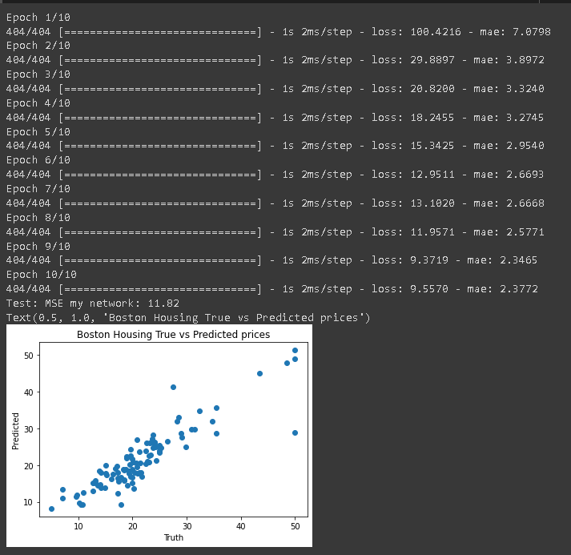
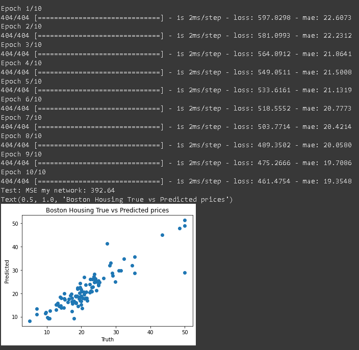

## 1. Introduction

#### What is your MSE/MAE with linreg vs tuned network?

---

Linreg: 26.61 (MSE), 3.6467 (MAE)

Tuned: 

#### What happens to your train and test results if you add 5 hidden layers with 128 neurons each?

---

NOTE: Though in most cases adding the layers slightly improved the results, the variance of outcomes may be drastic. 
If the initial guess is off, the weights will converge to the incorrect local minima, leaving our prediction poor. 
This being said, the more layers, the more complexity, and the solution in part A was often near or better than that of 
part B, with _less_ variance, therefore I would leave out this extra hidden layers.

## 2. Intro to convolution operations: padding

## 3. Convolution parameters: stride and pooling

## 4. ConvNet Architectures, layers

## 5. Practical patterns
